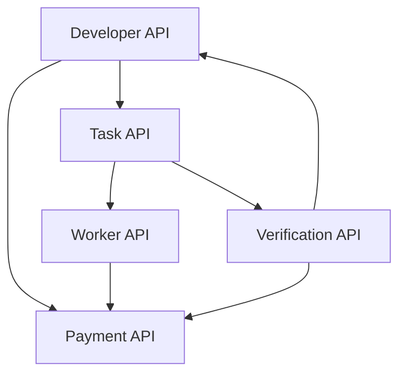

# Mindburn Aletheia API Architecture

## Overview
Mindburn Aletheia's API architecture follows a microservices pattern with five core services:
- Developer API: Task submission and result retrieval
- Task Distribution API: Worker assignment and task management
- Verification API: Result validation and quality control
- Payment API: TON blockchain transactions and escrow
- Worker API: Profile management and performance tracking

## Authentication & Security
- External APIs (Developer, Worker) use JWT bearer tokens
- Internal APIs use API key authentication
- All endpoints enforce rate limiting
- Sensitive data is encrypted at rest and in transit
- TON wallet operations require additional signature verification

## Integration Patterns

### Synchronous Operations
- Task submission and validation
- Worker profile management
- Balance checks and transaction status
- Task assignment status updates

### Asynchronous Operations
- Task verification process
- Payment processing
- Worker notifications
- Task result aggregation

### Event-Driven Communication
Services communicate through AWS SNS/SQS for:
- Task status updates
- Verification results
- Payment confirmations
- Worker availability changes

### Webhook Notifications
- Task completion notifications
- Payment status updates
- TON blockchain events
- Worker performance alerts

## Rate Limiting
- Developer API: 100-1000 requests/minute based on endpoint
- Task API: 500-1000 requests/minute
- Verification API: 100-1000 requests/minute
- Payment API: 100-1000 requests/minute
- Worker API: 100 requests/minute

## Error Handling
All APIs follow a consistent error response format:
```json
{
  "code": "ERROR_CODE",
  "message": "Human readable message",
  "details": {
    "field": "Additional error context"
  }
}
```

Common HTTP status codes:
- 400: Invalid request
- 401: Unauthorized
- 403: Forbidden
- 404: Resource not found
- 429: Rate limit exceeded
- 500: Internal server error

## Pagination
List endpoints support cursor-based pagination with:
- page: Page number (default: 1)
- limit: Items per page (default: 20, max: 100)
- Response includes total count and next page token

## Data Flow

### Task Creation & Assignment
1. Developer submits task (Developer API)
2. Task is queued for assignment (Task API)
3. Workers are matched based on availability and skills
4. Selected workers receive task notifications
5. Workers accept/reject assignments
6. Task status is updated and monitored

### Verification Process
1. Worker submits verification result (Worker API)
2. Result is validated (Verification API)
3. Quality control checks are performed
4. Results are aggregated when threshold is met
5. Final result is returned to developer

### Payment Flow
1. Developer funds escrow contract (Payment API)
2. Task completion triggers payment release
3. TON blockchain transaction is initiated
4. Transaction status is monitored
5. Workers receive confirmation of payment
6. Transaction details are recorded

## Service Dependencies


## API Versioning
- APIs are versioned in URL path (/v1)
- Breaking changes trigger version increment
- Multiple versions supported simultaneously
- Deprecation notices provided 6 months in advance

## Monitoring & Logging
- Request/response logging with correlation IDs
- Performance metrics collection
- Error rate monitoring
- Blockchain transaction tracking
- Worker performance analytics

## Development Guidelines
1. Follow OpenAPI 3.0 specification
2. Maintain backward compatibility
3. Document all changes in changelog
4. Include request/response examples
5. Test against staging environment
6. Monitor performance impact 