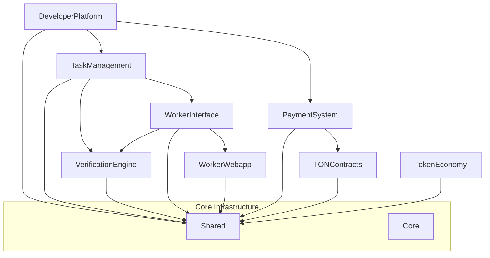

# Project Architecture

## Packages

The project is organized into the following packages:

```
packages/
├── core/               # Core shared utilities
├── shared/             # Shared types and components
├── developerPlatform/  # Developer Platform API
├── taskManagement/     # Task distribution logic
├── verificationEngine/ # Core Logic
├── workerInterface/    # Telegram Bot + API
├── workerWebapp/       # Mini App
├── paymentSystem/      # Payment processing
├── tonContracts/       # TON Blockchain contracts
└── tokenEconomy/       # Tokenomics
```

## Architecture

### Component Diagram



## Deployment


# Architecture Overview

## System Context


Mindburn Aletheia operates as a bridge between AI developers and human verifiers, utilizing Telegram's ecosystem for interaction and TON blockchain for payments.

### Key Stakeholders

- **AI Developers**: Submit models and tasks for verification
- **Human Verifiers**: Complete verification tasks through Telegram
- **Platform Administrators**: Manage system and oversee operations

## Component Architecture


### Worker Interface

The user-facing component handling interactions with human verifiers.

- **Telegram Bot**

  - Task distribution and notifications
  - User registration and management
  - Wallet connection via TON Connect
  - Real-time status updates

- **Mini App**
  - Task visualization and submission
  - Earnings dashboard
  - Wallet management
  - Profile settings

### Developer Platform

The interface for AI developers to interact with the platform.

- **REST API**

  - Task submission and management
  - Result retrieval
  - Analytics and reporting
  - Authentication and authorization

- **Dashboard**
  - Project management
  - Task monitoring
  - Performance analytics
  - Billing and payments

### Task Management System

Handles task distribution and lifecycle management.

- **Components**

  - Task Queue (AWS SQS)
  - Task Store (DynamoDB)
  - Assignment Engine
  - Status Tracker

- **Features**
  - Intelligent task routing
  - Load balancing
  - Priority management
  - Deadline tracking

### Verification Engine

Core business logic for task verification.

- **Components**

  - Validation Rules Engine
  - Quality Control System
  - Result Aggregator
  - Performance Analyzer

- **Features**
  - Result validation
  - Quality scoring
  - Consensus algorithms
  - Performance metrics

### Payment System

Handles all payment-related operations using TON blockchain.

- **Components**

  - TON Connect Integration
  - Smart Contracts
  - Payment Processor
  - Transaction Monitor

- **Features**
  - Secure micropayments
  - Automated settlements
  - Transaction verification
  - Payment disputes

## Technology Stack

### Backend Services

- Node.js with TypeScript
- AWS Lambda for serverless compute
- DynamoDB for data storage
- SQS/SNS for messaging
- CloudWatch for monitoring

### Frontend Applications

- React with TypeScript
- Mantine UI framework
- TON Connect SDK
- Telegram Mini App SDK

### Infrastructure

- AWS CDK for IaC
- Serverless Framework
- CloudFormation
- GitHub Actions for CI/CD

### Security

- AWS KMS for encryption
- Cognito for authentication
- WAF for API protection
- CloudTrail for audit logging

## Data Flow


1. **Task Submission**

   ```mermaid
   sequenceDiagram
   Developer->>API: Submit Task
   API->>TaskQueue: Enqueue
   TaskQueue->>AssignmentEngine: Process
   AssignmentEngine->>Bot: Notify Workers
   ```

2. **Task Verification**
   ```mermaid
   sequenceDiagram
   Worker->>MiniApp: Submit Result
   MiniApp->>API: Validate
   API->>VerificationEngine: Process
   VerificationEngine->>PaymentSystem: Trigger Payment
   ```

## Security Architecture

### Data Protection

- Field-level encryption for sensitive data
- Secure key management with AWS KMS
- Data classification and handling policies

### Authentication & Authorization

- JWT-based authentication
- Role-based access control
- Multi-factor authentication
- Session management

### Network Security

- VPC configuration
- Security groups
- WAF rules
- DDoS protection

## Scalability

### Horizontal Scaling

- Auto-scaling Lambda functions
- DynamoDB on-demand capacity
- SQS for load leveling

### Performance Optimization

- CloudFront for content delivery
- DynamoDB GSIs for query optimization
- Lambda provisioned concurrency
- Response caching

## Monitoring & Observability

### Metrics

- API latency and errors
- Task completion rates
- Payment success rates
- System health checks

### Logging

- Structured logging
- Audit trails
- Error tracking
- Performance monitoring

## Disaster Recovery

### Backup Strategy

- Continuous DynamoDB backups
- S3 versioning
- Cross-region replication
- Regular testing

### Recovery Procedures

- RTO/RPO objectives
- Failover procedures
- Data restoration
- Business continuity

## Development Guidelines

### Code Organization

```
packages/
├── workerInterface/     # Telegram Bot + API
├── workerWebapp/        # Mini App
├── developerPlatform/   # Developer API
├── taskManagement/     # Task System
├── verificationEngine/   # Core Logic
└── paymentSystem/       # TON Integration
```

### Best Practices

- TypeScript for type safety
- Unit test coverage > 80%
- Code review requirements
- Documentation standards

## Deployment Strategy

### Environments

- Development
- Staging
- Production

### Deployment Process

1. Code review and approval
2. Automated testing
3. Staging deployment
4. Production deployment

## Version Control

### Branching Strategy

- main: Production code
- develop: Integration branch
- feature/\*: Feature branches
- release/\*: Release branches

### Release Process

1. Version bump
2. Changelog update
3. Tag creation
4. Deployment

## Future Considerations

### Planned Improvements

- Enhanced analytics
- ML-based task routing
- Advanced fraud detection
- Performance optimizations

### Scalability Plans

- Multi-region deployment
- Enhanced caching
- Performance optimization
- Capacity planning
